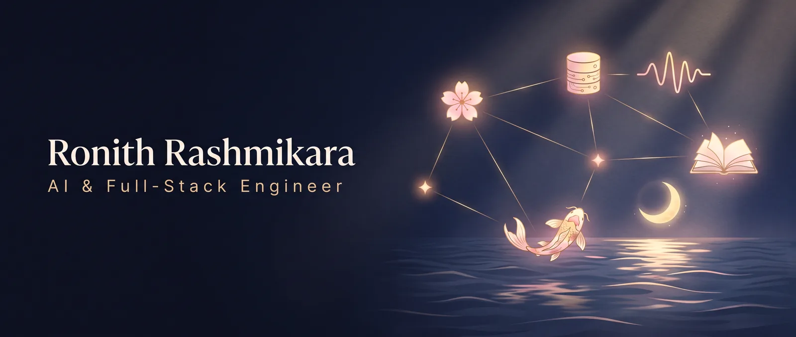

# Ronith Rashmikara

**AI & Full-Stack Engineer**

I build real-time generative products, transactional business systems and reproducible ML evaluations.

---

## Best proof

| Signal | Work |
|---|---|
| 🛡️ **AI-safety research** | [DataAgent-SafeBench](https://github.com/ronithrashmikara/dataagent-safebench): 120 controlled cases, 720 scored runs (120 cases × 3 open-weight models × 2 repetitions) testing authority confusion and prompt injection in AI data agents. **Best Presenter, AI track, JASPER 2026** (Lanka Nippon BizTech Institute, LNBTI). |
| 📄 **Published paper** | First-author paper in the *JASPER Research Journal*, Vol. 1 (LNBTI): classical computer-vision feature analysis (colour, LBP/GLCM texture, symmetry) of Sri Lankan and Japanese textile designs. [DOI 10.5281/zenodo.19703123](https://doi.org/10.5281/zenodo.19703123) · [Dataset on Kaggle](https://www.kaggle.com/datasets/ronithrr/jasper-japanese-x-sri-lankan-textile-image-dataset) · [Code](https://github.com/ronithrashmikara/Jasper) (sample run; its README lists known differences from the paper) |
| 🏁 **Competition** | Ranked **50th of 490** on the final out-of-sample leaderboard of the [ADIA Lab Structural Break Challenge](https://hub.crunchdao.com/competitions/structural-break/leaderboard) (CrunchDAO, 2025). ROC AUC 76.40% with engineered time-series features and a LightGBM ensemble. |
| 🌸 **Team product** | [Project Green Orchids](https://github.com/ronithrashmikara/Project-Green-Orchids): B2B wholesale platform built by a five-person team that I led. Six role-based workspaces, and an integration test suite that runs on real PostgreSQL in CI. |
| 🎌 **Real-time generative product** | [Yume](https://github.com/ronithrashmikara/yume) ([live](https://yume-inky.vercel.app)): a language-learning game built on Visko Orbis, a real-time steerable video model. Speak Japanese or English to change a live AI-generated world. |

## Selected work

Case studies and write-ups live on **[ronith.dev/work](https://ronith.dev/work)**.

| Project | What it is | Stack | Links |
|---|---|---|---|
| 🎌 **Yume** | Language-learning game: a correct spoken sentence steers a live AI-generated video world. | Next.js · TypeScript · Visko Orbis · WebRTC | [Code](https://github.com/ronithrashmikara/yume) · [Live](https://yume-inky.vercel.app) |
| 🌸 **Project Green Orchids** | Team project (team lead) on a hypothetical orchid-exporter brief: RFQ → quote → order, tier pricing, invoicing, returns, delivery and RBAC. | Next.js · Express · PostgreSQL · GitHub Actions | [Code](https://github.com/ronithrashmikara/Project-Green-Orchids) |
| 🚀 **Project Alpha** | Freelance marketplace: project discovery, bidding, simulated escrow, reviews, disputes and admin tools. | Next.js · Laravel · PostgreSQL | [Code](https://github.com/ronithrashmikara/alpha-freelance-platform-enhanced) · [Case study](https://ronith.dev/work/alpha-freelance-platform) |
| 🌲 **FlowMind** | Multi-document workspace: knowledge trees, summaries, flashcards and a tutor that cites its sources. | Next.js · FastAPI · Mistral · Modal | [Code](https://github.com/ronithrashmikara/FlowMind) |
| 🧠 **PersonaBench Aiko** | LoRA fine-tune of Qwen2.5-1.5B-Instruct for a consistent character, compared with prompting baselines on 20 held-out prompts. | PEFT · LoRA · Transformers | [Model](https://huggingface.co/ronithrashmikara/personabench-aiko-qwen2.5-1.5b-lora) + [dataset](https://huggingface.co/datasets/ronithrashmikara/personabench-aiko) (training code not yet public) |
| 📑 **Document Pipeline** | Ask questions over uploaded PDFs and get answers with source citations. | Streamlit · LangChain · FAISS · Mistral | [Code](https://github.com/ronithrashmikara/Document-PIPE-line-Mistral) |
| 🐦 **Flock-Emerge** | Boids flocking simulation with predator–prey steering. | JavaScript · p5.js | [Code](https://github.com/ronithrashmikara/Flock-Emerge) · [Live](https://ronithrashmikara.github.io/Flock-Emerge/) |
| 🎤 **3D Viva Planner** | Three.js rehearsal room for the Project Green viva: slides, posters and five presenters. | Three.js | [Code](https://github.com/ronithrashmikara/project-green-3d-viva-planner) · [Live](https://ronithrashmikara.github.io/project-green-3d-viva-planner/) |

Smaller and earlier work: [AI-Agent-Capstone](https://github.com/ronithrashmikara/AI-Agent-Capstone) (Nov 2025 multi-agent tutor that came before FlowMind) · [Advent of FPGA 2025](https://github.com/ronithrashmikara/FPGA-2025-AOC-Submission) (an introductory SystemVerilog puzzle solution) · [DSA](https://github.com/ronithrashmikara/DSA) (coursework-style Java data structures) · [project-archive](https://github.com/ronithrashmikara/project-archive) (early learning projects).

Immersive-web projects (Gaussian-splat worlds) are documented as case studies on [ronith.dev](https://ronith.dev/work). Their repositories are private.

## How I work

I build with Claude Code as an AI pair-programmer. I own the architecture, the tests and the measurements, and I review every change. The `Co-Authored-By` trailers in my commit history show this.

## Writing

- [The Edge You Can't Prompt](https://ronith.dev/essays/the-edge-you-cant-prompt)
- [Software That Feels Like a Place](https://ronith.dev/essays/software-that-feels-like-a-place)

## Currently

- 🎌 Building Japanese-learning tools on real-time generative models, starting with [Yume](https://github.com/ronithrashmikara/yume).
- 🌱 Cleaning up older work in [project-archive](https://github.com/ronithrashmikara/project-archive).

## Toolkit

**Languages:** `Python` `TypeScript` `JavaScript` `PHP` `SQL`

**Product and backend:** `Next.js` `React` `Node.js` `Express` `Laravel` `FastAPI` `PostgreSQL` `SQLite` `Docker` `GitHub Actions`

**AI / ML:** `LLM evaluation` `LoRA fine-tuning (PEFT)` `LangChain` `FAISS` `scikit-learn` `OpenCV`

**Real-time / 3D:** `WebRTC` `Three.js` `Canvas`

**Coursework and puzzles:** `Java` `SystemVerilog`

## Contribution activity

  
    
  

